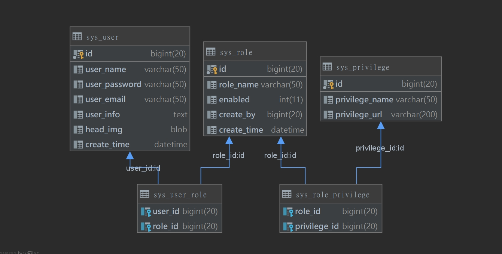
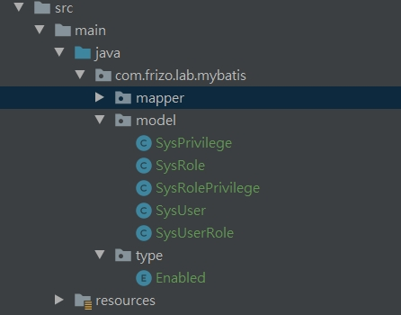
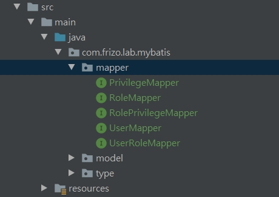
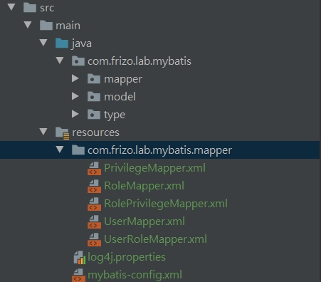

# Mybatis XML 基本使用方法

<br>

---

<br>

## 建立 Table

<br>

採用 RBAC（Role-Based Access Control，基於角色訪問控制），設計一套權限控制結構：

<br>



<br>

db schema：

```sql
create table sys_privilege
(
    id             bigint auto_increment comment '權限 ID'
        primary key,
    privilege_name varchar(50)  null comment '權限名稱',
    privilege_url  varchar(200) null comment '權限 URL'
)
    comment '權限表';

INSERT INTO mybatis.sys_privilege (id, privilege_name, privilege_url) VALUES (1, '使用者管理', '/users');
INSERT INTO mybatis.sys_privilege (id, privilege_name, privilege_url) VALUES (2, '角色管理', '/roles');
INSERT INTO mybatis.sys_privilege (id, privilege_name, privilege_url) VALUES (3, '系統日誌', '/logs');
INSERT INTO mybatis.sys_privilege (id, privilege_name, privilege_url) VALUES (4, '人員維護', '/persons');
INSERT INTO mybatis.sys_privilege (id, privilege_name, privilege_url) VALUES (5, '單位維護', '/companies');


create table sys_role
(
    id          bigint auto_increment comment '角色 ID'
        primary key,
    role_name   varchar(50) null comment '角色名',
    enabled     int         null comment '有效標誌',
    create_by   bigint      null comment '創建人 ID',
    create_time datetime    null comment '創建時間'
)
    comment '角色表';

INSERT INTO mybatis.sys_role (id, role_name, enabled, create_by, create_time) VALUES (1, '管理員', 1, 1, '2022-04-01 17:02:14');
INSERT INTO mybatis.sys_role (id, role_name, enabled, create_by, create_time) VALUES (2, '普通使用者', 1, 1, '2022-04-01 17:02:34');


create table sys_role_privilege
(
    role_id      bigint null comment '角色 ID',
    privilege_id bigint null comment '權限 ID',
    constraint sys_role_privilege_sys_privilege_id_fk
        foreign key (privilege_id) references sys_privilege (id),
    constraint sys_role_privilege_sys_role_id_fk
        foreign key (role_id) references sys_role (id)
)
    comment '角色權限關聯表';

INSERT INTO mybatis.sys_role_privilege (role_id, privilege_id) VALUES (1, 1);
INSERT INTO mybatis.sys_role_privilege (role_id, privilege_id) VALUES (1, 3);
INSERT INTO mybatis.sys_role_privilege (role_id, privilege_id) VALUES (1, 2);
INSERT INTO mybatis.sys_role_privilege (role_id, privilege_id) VALUES (2, 4);
INSERT INTO mybatis.sys_role_privilege (role_id, privilege_id) VALUES (2, 5);


create table sys_user
(
    id            bigint auto_increment comment '使用者 ID'
        primary key,
    user_name     varchar(50)                           null comment '使用者名稱',
    user_password varchar(50)                           null comment '使用者密碼',
    user_email    varchar(50) default 'test@mybatis.tk' null comment '信箱',
    user_info     text                                  null comment '簡介',
    head_img      blob                                  null comment '頭像',
    create_time   datetime                              null comment '創建時間'
)
    comment '使用者表';

INSERT INTO mybatis.sys_user (id, user_name, user_password, user_email, user_info, head_img, create_time) VALUES (1, 'admin', '123456', 'Jarvan1110@gmail.com', '管理員', 0x1231231230, '2022-06-07 01:11:12');
INSERT INTO mybatis.sys_user (id, user_name, user_password, user_email, user_info, head_img, create_time) VALUES (1001, 'test', '123456', 'johnnywang@gashpoint.com', '一般使用者', 0x1231231230, '2022-06-07 00:00:00');


create table sys_user_role
(
    user_id bigint null comment '使用者 ID',
    role_id bigint null comment '角色 ID',
    constraint sys_user_role_sys_role_id_fk
        foreign key (role_id) references sys_role (id),
    constraint sys_user_role_sys_user_id_fk
        foreign key (user_id) references sys_user (id)
)
    comment '使用者角色關聯表';

INSERT INTO mybatis.sys_user_role (user_id, role_id) VALUES (1, 1);
INSERT INTO mybatis.sys_user_role (user_id, role_id) VALUES (1, 2);
INSERT INTO mybatis.sys_user_role (user_id, role_id) VALUES (1001, 2);
```


<br>

一個使用者可以同時傭有多個角色身分，一個角色身分可以有多個權限。

權限可以對某個資源進行某些操作 （增 刪 改 查）。

<br>
<br>
<br>
<br>

## 根據 Table 建立實體類 Entity

<br>

範例都放在 Model package 里。



<br>
<br>
<br>
<br>

## 配置 Mapper

<br>

建立 Mapper interface：

<br>



<br>

建立 Mapper xml：

<br>



<br>
<br>
<br>
<br>


## 配置 mybatis-config.xml

<br>

```xml
<?xml version="1.0" encoding="UTF-8" ?>
<!DOCTYPE configuration
        PUBLIC "-//mybatis.org//DTD Config 3.0//EN"
        "http://mybatis.org/dtd/mybatis-3-config.dtd">
<configuration>
    <!--    配置 log4j 作為輸出日誌-->
    <settings>
        <setting name="logImpl" value="LOG4J"/>
    </settings>
    <!--配置常用 package 別名-->
    <typeAliases>
        <package name="com.frizo.lab.mybatis.model"/>
    </typeAliases>
    <!--配置資料庫連線-->
    <environments default="development">
        <environment id="development">
            <transactionManager type="JDBC">
                <property name="" value=""/>
            </transactionManager>
            <dataSource type="UNPOOLED">
                <property name="driver" value="com.mysql.jdbc.Driver"/>
                <property name="url" value="jdbc:mysql://localhost:3306/mybatis?serverTimezone=UTC&amp;characterEncoding=utf-8"/>
                <property name="username" value="root"/>
                <property name="password" value="Jarvan1110"/>
            </dataSource>
        </environment>
    </environments>

    <!--    MyBatis 的 SQL 語句與映射配置文件-->
    <mappers>
        <package name="com.frizo.lab.mybatis.mapper"/>
    </mappers>
</configuration>
```

<br>
<br>
<br>
<br>

## select 用法

<br>

寫在 UserMapper.xml 里，可以參考。

```xml
    <!-- Entity 與 DB_Table 欄位對應設定 -->
	<resultMap id="userMap" type="com.frizo.lab.mybatis.model.SysUser">
		<id property="id" column="id"/> <!--必填欄位-->
		<result property="userName" column="user_name"/>
		<result property="userPassword" column="user_password"/>
		<result property="userEmail" column="user_email"/>
		<result property="userInfo" column="user_info"/>
		<result property="headImg" column="head_img" jdbcType="BLOB"/>
		<result property="createTime" column="create_time" jdbcType="TIMESTAMP"/>
	</resultMap>

	<!-- <select> 映射查詢語句 -->
	<!-- resultMap 設定返回值的類型與映射關係 -->
	<!-- #{id} 是傳入參數名稱 -->
	<select id="selectById" resultMap="userMap">
		select * from sys_user where id = #{id}
	</select>

	<!-- resultType 指定返回類型 -->
	<select id="selectAll" resultType="com.frizo.lab.mybatis.model.SysUser">
		select id,
			user_name,
			user_password,
			user_email,
			user_info,
			head_img,
			create_time
		from sys_user
	</select>
```

<br>
<br>
<br>
<br>

## insert 用法

<br>

範例：

<br>

```xml
<insert id="insertWithSelectKey">
	insert into sys_user(
				user_name, user_password, user_email, user_info, head_img, create_time

	)
	values(#{userName}, #{userPassword}, #{userEmail},
		#{userInfo}, #{headImg, jdbcType=BLOB}, #{createTime, jdbcType=TIMESTAMP})
	<selectKey keyColumn="id" resultType="long" keyProperty="id" order="AFTER">
		SELECT LAST_INSERT_ID()
	</selectKey>
</insert>
```

<br>

以上是新增一筆資料後，回填 key 值。(key 是自動增加的)

<br>

mysql 可以在新增完資料後取得剛剛新增的資料 PK 值，使用 `SELECT LAST_INSERT_ID()` 就可以知道剛剛新增的資料 PK 值是多少，並回填。

Oracle 就不行了，因為它不支援 PK 自動增值，它的作法是在新增前使用序列得到一個值，然後把值賦予 id，再將資料寫入。所以它的 PK 值是在寫入前就已經知道了的。對於 Oracle，寫法要換成如下：

<br>


```xml
<insert id="insertWithSelectKey">
    <selectKey keyColumn="id" resultType="long" keyProperty="id" order="BEFORE">
		SELECT SEQ_ID.nextval from dual
	</selectKey>
	insert into sys_user(
				id, user_name, user_password, user_email, user_info, head_img, create_time

	)
	values(#{id}, #{userName}, #{userPassword}, #{userEmail},
		#{userInfo}, #{headImg, jdbcType=BLOB}, #{createTime, jdbcType=TIMESTAMP})
</insert>
```

<br>

selectKey 的 order 欄位值填 `BEFORE` 意思是值是在 insert 前取得， `AFTER` 指在 insert 後取得。所以在使用 mysql 或 oracle 要注意區分。 selectKey 插入 xml 的位置不重要，order 值才重要。

<br>

其他支援 PK autoIncrease 的 DB，selectKey 需要帶入的語法這邊總結一下：

<br>

* DB2： `VALUES IDENTITY_VAL_LOCAL()`

* MYSQL： `SELECT LAST_INSERT_ID()`

* SQL_SERVER： `SELECT SCOPE_IDENTITY()`

* DERBY `VALUES IDENTITY_VAL_LOCAL()`

* CLOUDSCAPE： `VALUES IDENTITY_VAL_LOCAL()`

* INFORMIX： `select dbinfo('sqlca.sqlerrd1') from systables where tabid=1`

<br>
<br>
<br>
<br>

## update 用法

<br>

範例：

<br>

```xml
<update id="update">
	update sys_user
	set user_name = #{userName},
		user_password = #{userPassword},
		user_email = #{userEmail},
		user_info = #{userInfo},
		head_img = #{headImg, jdbcType=BLOB},
		create_time = #{createTime, jdbcType=TIMESTAMP}
	where id = #{id}
</update>
```

<br>
<br>
<br>
<br>

## update 用法

<br>

範例：

<br>

```xml
<delete id="delete">
	delete from sys_user where id = #{id}
</delete>
```

<br>
<br>
<br>
<br>

## 當 query 參數大於 1 個時

<br>

當 query 參數大於 1 個時，我們可以包成 Bean：

<br>

```java
int update(SysUser sysUser);
```

<br>

__SysUser__ 中包了很多參數，在 xml 中取用也很簡單：

<br>

```xml
<update id="update">
	update sys_user
	set user_name = #{userName},
		user_password = #{userPassword},
		user_email = #{userEmail},
		user_info = #{userInfo},
		head_img = #{headImg, jdbcType=BLOB},
	create_time = #{createTime, jdbcType=TIMESTAMP}
	where id = #{id}
</update>
```

<br>

如果今天有個方法用到 2 個參數以上：

<br>

```java
public List<SysRole> selectRolesByUserIdAndRoleEnabled(Long userId, ("enabled") Integer enabled);
```

<br>

xml 中這樣配置：

<br>

```xml
<select id="selectRolesByUserIdAndRoleEnabled" resultType="com.frizo.lab.mybatis.model.SysRole">
	select
	    sr.id,
		sr.role_name,
		sr.enabled,
		sr.create_by,
		sr.create_time
	from sys_role as sr
	inner join sys_user_role as sur on sur.role_id = sr.id
	where sur.user_id = #{userId} and sr.enabled = #{enabled}
</select>
```

<br>

這樣執行方法一定會出錯：

<br>

```
Cause: org.apache.ibatis.binding.BindingException: 
    Parameter 'userId' not found. Available parameters are [0, 1, param1, param2]
```

<br>

Mybatis 遇到 JavaBean 可以自動映射 JavaBean 值對應名稱，但是使用 Java 基本類就沒辦法識別了。他只知道 [0, 1, param1, param2]。有人會問，之前一個值明明就可以，那是因為就一個值，Mybatis 不管那麼多直接抓來用了。

<br>

改變一下 interface 的參數輸入就可以用了：

<br>

```
List<SysRole> selectRolesByUserIdAndRoleEnabled(@Param("userId") Long userId,@Param("enabled") Integer enabled);
```

<br>

加入 `@Param` Mybatis 自動將參數封裝成 __Map__。`@Param` 的值就是 key。

<br>

如果需要使用 2 個 Bean 作為 query 參數需要這樣寫：

<br>

```java
List<SysRole> selectRolesByUserIdAndRoleEnabled(@Param("user") SysUser user,@Param("role") SysRole role);
```

<br>

xml 中調用要這樣用：`# {user.id}` 與 `#{role.enabled}`

<br>
<br>
<br>
<br>

## Mapper interface 動態代理實現原理

<br>

如果好其為甚麼定義了 Mapper 介面之後，用 `sqlSession.getMapper()` 就可以取得 mapper 實現，那是因為 Mybatis 使用了動態代理機制，下面使用一個範例說明：

<br>

```java
public class MyMapperProxy<T> implements InvocationHandler {

    private Class<T> mapperInterface;

    private SqlSession sqlSession;

    public MyMapperProxy(Class<T> mapperInterface, SqlSession sqlSession){
        this.mapperInterface = mapperInterface;
        this.sqlSession = sqlSession;
    }

    @Override
    public Object invoke(Object proxy, Method method, Object[] args) throws Throwable {
        return sqlSession.<T>selectList(
                // 拼接方法出完整方法路徑+名稱
                mapperInterface.getCanonicalName() + "." + method.getName()
        );
    }
}
```

<br>

測試：

<br>

```java
public class MyMapperProxyTest extends BaseMapperTest {

    @Test
    public void testInvocation(){
        try(SqlSession sqlSession = getSqlSession()){
            MyMapperProxy<UserMapper> mapperProxy = new MyMapperProxy<>(UserMapper.class, sqlSession);
            UserMapper userMapper = (UserMapper) Proxy.newProxyInstance(Thread.currentThread().getContextClassLoader(),
                    new Class[]{UserMapper.class},
                    mapperProxy);
            List<SysUser> users = userMapper.selectAll();
            Assert.assertTrue(users.size() > 0);
        }
    }

}
```

